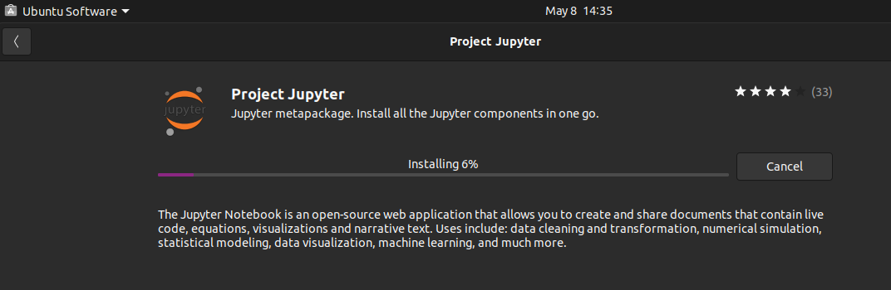

# jupyter
some Jupyter notebooks
## Setup
Setting up Jupyter on both Windows 10 and Ubuntu 20.04 could be done using GUI installers
### Windows 10
I installed Anaconda by downloading the Windows 64-bit .exe file walking through the GUI installer
### Ubuntu 20.04
I installed Project Jupyter using the Ubuntu Software GUI

